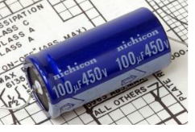
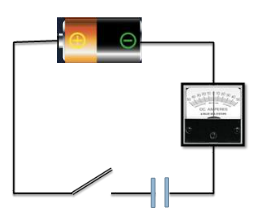
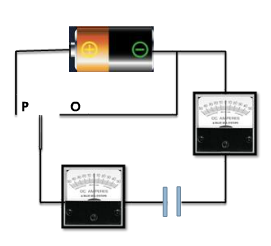

# Theory

## What is Capacitor?
It is one of the passive components like resistor. Capacitor is also known as condenser. Capacitor is generally used to store the charge. The charge is stored in the form of “electrical field”. Capacitors play a major role in many electrical and electronic circuits.

Figure: 1 

## Construction of a Capacitor

The basic construction of all capacitors is of two parallel metal plates separated by an insulating material (the dielectric). An insulator is a material which is non-conducting i.e. it shows a high resistance to letting to electric used is air, other types are oil or paper. Real capacitors are made by taking thin strips of metal foil and the appropriate dielectric material and sandwiching them together.

Figure: 2 

Capacitor achieve large area (thus large capacitance) by doing something tricky, such as putting a dielectric between 2 layers of metal foil and rolling it up like in this figure.

Figure: 3 

### Capacitance

A capacitor is so called because it has the capacity to store charge- just like a beaker storing a liquid. Capacitors are marked with a value which indicates their capacitance – their ability to store charge . Capacitance can be thought of as the “electrical capacity” of that body. It is measured in Farads.

Figure: 4 

### Note- Maximum Working Voltage

If the voltage across a capacitor is too high, the insulator between the plates fails to insulate and charge passes from one plate to the other . Capacitor are usually marked with the maximum working voltage to help the user avoid situation .
A good rule of thumb is to never place a voltage across the capacitor which exceeds about two thirds of this value, especially for alternating current circuits.

### Mathematical Notation

- A static description of the way a capacitor behaves would be to say Q=C×V , where Q is the total charge, C is a measure of how big the capacitor is and V is the voltage across it.
- A dynamic description ,ie one that changes with time would be to say $$I=C×\frac{dV}{dt}$$ . This is just the time derivative of the static description .C is constant wrt time, I is the rate at which charge flows . This essentially says – the bigger the current , the faster the capacitor’s voltage changes.

## Classification of Capacitors
UN-POLARIZED | POLARIZED 
:--|:--|
Ceramic | Electrolytic |
Multiayer | Tantalum |
Polystyrene Film | Super |
Polyster Film | They have positive and negative electrode |
Polypropylene |  | 
Mica | |
They don't have positive and negative electrode | |

### Ceramic Capacitors

Figure: 5 

Ceramic capacitors are the most used capacitors in the electronics industry. Ceramic capacitors are fixed capacitance type capacitors and they are usually very small (in terms of both physical dimensions and capacitance). The capacitance of ceramic capacitors is usually in the range of picofarads to few micro farads (less than 10µF). They are non-polarised type capacitors and hence can be used in both DC as well as AC circuits.

### Electrolytic Capacitor

Figure: 6 

Electrolytic capacitors are polarized and they must be connected the correct way round , atleast one of their leads will be marked + or – . It is very easy to find the values of electrolytic capacitors because they are clearly printed with their capacitance and voltage rating.

### Tantalum Capacitor

Figure: 7 

Tantalum bead capacitors are polarized and have low voltage ratings like electrolytic capacitors . Usually , the “+” symbol is used to show the positive component lead . Modern tantalum bead capacitors are printed with their capacitance voltage and polarity in full. However older ones use a color – code systems which has two stripes (for the two digits ) and a spot of color for the number of zeros to give the value in uF.

### Un-polarized Capacitors- small values(upto 1uF)

Figure: 8 

The value printed but without a multiplier, so you need to use experience to work out what the multiplier should be! For example 0.1 means 0.1 pF. Sometimes the multiplier is used in place of the decimal point: For example: 4n7 means 4.7nF.

## Un-polarized Capacitors — Capacitor Number Code

Figure: 9 

A number code is often used on small capacitors where printing is difficult: The 1st number is the 1st digit, the 2nd number is the 2nd digit, the 3rd number is the number of zeros to give the capacitance in pF. Ignore any letters - they just indicate tolerance and voltage rating. For example: 102 means 1000pF (not 102pF!) For example: 472J means 4700pF (J means 5% tolerance).

### Un-polarized Capacitors — Capacitor Color Code

Figure: 10 

### Capacitors in series

Capacitors in series means two or more capacitors connected in a single line. Positive plate of the one capacitor is connected to the negative plate of the next capacitor.

Figure: 11 

$$Q_T= Q_1=Q_2=.... =Q$$

$$I_C = I1=I2=...=I$$

where,
$$Q_T$$ is the total charge,
$$I_C$$ is the capacitive current

When the capacitors are connected in series Charge and current is same on all the capacitors.

For series capacitors same quantity of electrons will flow through each capacitor because the charge on each plate is coming from the adjacent plate. So, coulomb charge is same. As current is nothing but flow of electrons, current is also same.

Equivalent Capacitance for two capacitors in series,
$$\frac{1}{C_eq}=\frac{1}{C_1}+\frac{1}{C_2}$$
 
$$\frac{1}{C_eq}=\frac{C_1C_2}{C_1+C_2}$$

### Capacitors in parallel

When the capacitors are connected in parallel the total capacitance value is increased. There are some applications where higher capacitance values are required.

Figure: 12 

All the capacitors which are connected in parallel have the same voltage and is equal to the VT applied between the input and output terminals of the circuit.

$$V_T=V_1=V_2$

Equivalent Capacitance for two capacitors in parallel,
$$C_eq=C_1+C_2$$

### Function of Capacitance

Consider a circuit set up like the one at the side. What will happen when the switch is closed?
The ammeter will

- How a steady reading
- Show a reading of ’0’
- Flick back and forth
- Flick on one side and come back to ‘0’

Figure: 13 

Now let’s place large metal plate at each of the connectors a few millimetres apart.
What will happen when the switch is closed?
The Ammeter will
- Show a steady reading
- Show a reading of ‘0’
- Flick back and forth
- Flick on one sid and come back to ‘0’

Figure: 14 

Let us extend this by placing a galvanometer on both sides of the capacitor and using a two-way switch .
What will happen when the switch is connected to ‘P’?
For both of the Ammeters

- Neither moves
- Both flick briefly to left
- Both flick briefly to right
- They flick in opposite dirs

Figure: 15 

After moving to ‘P’ now the switch is moved to ‘O’.
What will happen?
For both of the Ammeters
- Neither moves
- Both flick briefly to left
- Both flick briefly to right
- They flick in opposite dirs

Figure: 16 

Instead of moving to ’P’ the first time ,if the switch is first moved to ‘O’ .
what will happen?
For both of the Ammeters
- Neither moves
- Both flick briefly to left
- Both flick briefly to right
- They flick in opposite dirs

Figure: 17 

The behaviour of the ammeter needles in the previous experiment suggests that a current flow firstly one way ,then the other as the switch is moved from P to O. So, this suggests
- Equal amounts of charge flows off one plate and onto the other
- More charge flows off plate A than plate B
- More charge flows off plate B than plate A
- No charge flows at all

Figure: 18 

### Charging and Discharging

We say that the capacitor is charged up when connected to P and discharged when moved to .

### Charging

The plate on the capacitor that attaches to the negative terminal of the battery accepts electrons that the battery is producing .The plate on the capacitor that attaches to the positive terminal of the battery loses electrons to the battery. Once it’s charged , the capacitor has the sam voltage as the battery.

Figure: 19 

### Charging - Question

Here you have a battery ,light bulb and a capacitor .If they are connected – what will happen to the bulb?

Figure: 20 

- It will never glow
- It will glow as long as the battery is connected
- It will first glow and then keep dimming and finally turn off

### Discharging

Figure: 21 

If you then remove the battery and replace it with a wire , current will flow from one plate of the capacitor to the other. The bulb will light initially and then dim as the capacitor discharges , until it is completely out.

A color code was used on polyester capacitors for many years. It is now obsolete, but of course there are many still around. The colors should be read like the resistor code, the top three color bands giving the value in pF. Ignore the 4th band (tolerance) and 5th band (voltage rating). .For example: brown, black, orange means 10000pF. Note that there are no gaps between the color bands, so 2 identical bands actually appear as a wide band. For example: wide red, yellow means 220nF.

